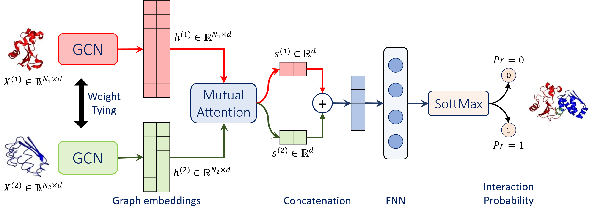

# Struct2Graph
A PyTorch implementation of GCN with mutual attention for protein-protein interaction prediction

Struct2Graph uses two graph  convolutional networks (GCNs) with weight sharing, and a mutual attention network to extract relevant geometric features related toquery protein pairs. The details of the GCN architecture is described in our paper (currently under review).

A dataset of 11160 interactions (5580 positive pairs, 5580 negative pairs) consisting of 4024 proteins was downloaded from UniProt Acc. and IntAct.

### Requirements
* PyTorch
* scikit-learn

### Usage
We provide multiple python scripts that incorporate functionalities, such as, downloading PDBs, proceesing them to create protein graphs, creating training and testing datasets and training a GCN-classifier. These scripts must be run in the following order:
1. download_pdbs.py - will download PDB files corresponding to proteins listed in "list_of_prots.txt".
2. parse_entries.py - will parse/preprocess all the downloaded PDB files.
3. create_examples.py - will create training and test datasets (both balanced, as well as unbalanced) using examples listed in "interactions_data.txt".
4. k-fold_cv.py - will train the classifier on the balanced set.

### Contact
Contact: <a href="https://web.eecs.umich.edu/~mayankb/">Mayank Baranwal, Postdoctoral Fellow, University of Michigan at Ann Arbor</a>

### Acknowledgements
The proposed GCN architecture comprising of mutual attention mechanism for interaction prediction between query proteins is built upon our prior work on using GCNs for metabolic pathway prediction [1].

### References
    1. Baranwal, Mayank, Abram Magner, Paolo Elvati, Jacob Saldinger, Angela Violi, and Alfred Hero. "A deep learning architecture for metabolic pathway prediction." Bioinformatics (2019)
